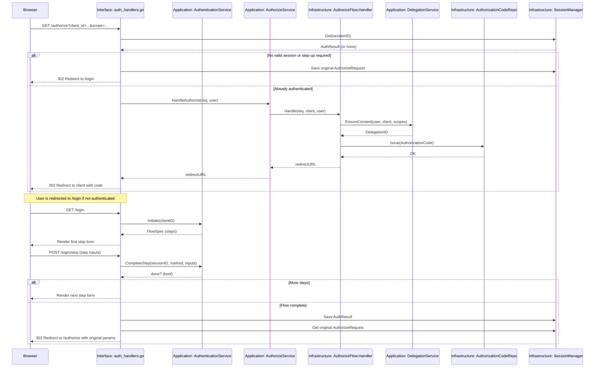

```mermaid
sequenceDiagram
    participant Browser
    participant AuthHandler as Interface: auth_handlers.go
    participant AuthSvc as Application: AuthenticationService
    participant AuthzSvc as Application: AuthorizeService
    participant FlowHandler as Infrastructure: AuthorizeFlow.Handler
    participant DelegationSvc as Application: DelegationService
    participant CodeRepo as Infrastructure: AuthorizationCodeRepo
    participant Session as Infrastructure: SessionManager

    Browser->>AuthHandler: GET /authorize?client_id=...&scope=...
    AuthHandler->>Session: Get(sessionID)
    Session-->>AuthHandler: AuthResult (or none)
    alt No valid session or step-up required
        AuthHandler->>Session: Save original AuthorizeRequest
        AuthHandler-->>Browser: 302 Redirect to /login
    else Already authenticated
        AuthHandler->>AuthzSvc: HandleAuthorize(req, user)
        AuthzSvc->>FlowHandler: Handle(req, client, user)
        FlowHandler->>DelegationSvc: EnsureConsent(user, client, scopes)
        DelegationSvc-->>FlowHandler: DelegationID
        FlowHandler->>CodeRepo: Issue(AuthorizationCode)
        CodeRepo-->>FlowHandler: OK
        FlowHandler-->>AuthzSvc: redirectURL
        AuthzSvc-->>AuthHandler: redirectURL
        AuthHandler-->>Browser: 302 Redirect to client with code
    end

    Note over Browser,AuthHandler: User is redirected to /login if not authenticated

    Browser->>AuthHandler: GET /login
    AuthHandler->>AuthSvc: Initiate(clientID)
    AuthSvc-->>AuthHandler: FlowSpec (steps)
    AuthHandler-->>Browser: Render first step form

    Browser->>AuthHandler: POST /login/step (step inputs)
    AuthHandler->>AuthSvc: CompleteStep(sessionID, method, inputs)
    AuthSvc-->>AuthHandler: done? (bool)
    alt More steps
        AuthHandler-->>Browser: Render next step form
    else Flow complete
        AuthHandler->>Session: Save AuthResult
        AuthHandler->>Session: Get original AuthorizeRequest
        AuthHandler-->>Browser: 302 Redirect to /authorize with original params
    end
```
